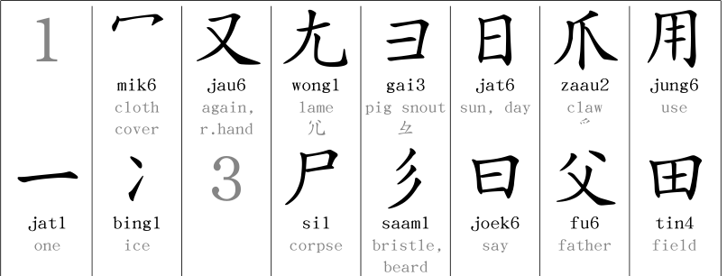
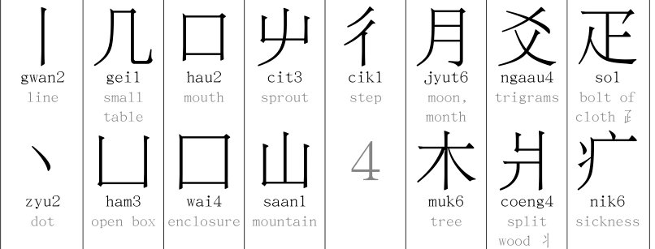
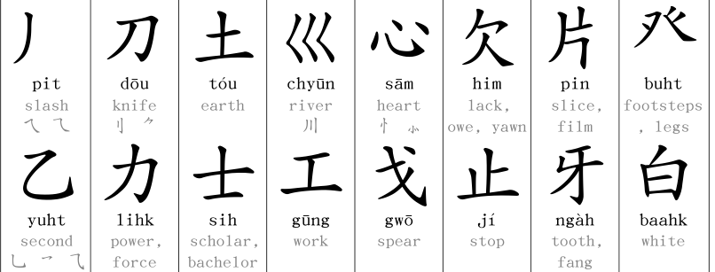
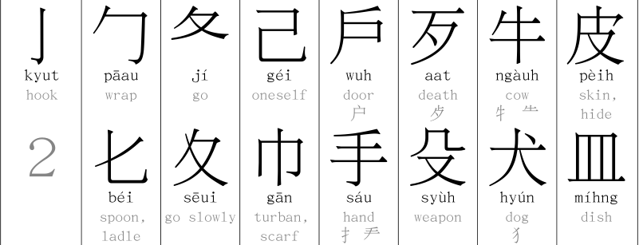

# Cantonese Radicals

A reference poster of the 214 Kangxi radicals with Cantonese romanization, typeset in various Hong Kong Chinese fonts.

## Contents

- [Radical Poster Romanisations and Fonts](#radical-poster-romanisations-and-fonts)
  - [Jyutping](#jyutping)
    - [AR PL UKai HK](#ar-pl-ukai-hk)
    - [AR PL UMing HK](#ar-pl-uming-hk)
  - [Yale](#yale)
    - [AR PL UKai HK](#ar-pl-ukai-hk)
    - [AR PL UMing HK](#ar-pl-uming-hk)
- [Building](#building)
- [Requirements](#requirements)
- [Sources](#sources)

## Radical Poster Romanisations and Fonts

### Jyutping

#### AR PL UKai HK

[](pdf/RadicalsPoster-Jyutping-AR_PL_UKai_HK.pdf)

#### AR PL UMing HK

[](pdf/RadicalsPoster-Jyutping-AR_PL_UMing_HK.pdf)

### Yale

#### AR PL UKai HK

[](pdf/RadicalsPoster-Yale-AR_PL_UKai_HK.pdf)

#### AR PL UMing HK

[](pdf/RadicalsPoster-Yale-AR_PL_UMing_HK.pdf)

## Building

```bash
# Install Python3 dependencies
make setup

# Show available fonts and variants
make debug

# Build a single variant, e.g.:
make Yale-AR_PL_UKai_HK

# Build all variants
make all

# Clean build artifacts (keep PDFs)
make clean

# Clean everything including PDFs
make clean-all
```

## Requirements

- XeLaTeX
- Python 3 with pymupdf (`make setup`)
- Hong Kong Chinese fonts

## Sources

- <https://repository.lib.cuhk.edu.hk/en/item/cuhk-2023821>
- <https://www.cantoneseclass101.com/chinese-radicals/>
- <https://en.wikipedia.org/wiki/Kangxi_radicals>
- <https://github.com/twighk/CantoneseRadicals>